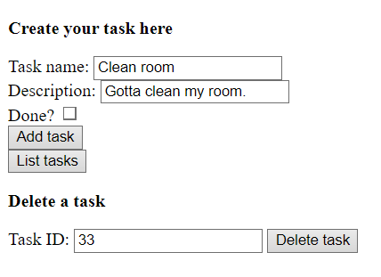

# Task Manager
A Java project that consists of a simple web-based task manager. It is a Spring application that is hosted locally and allows the user to create tasks (consisting of a title, a description and a checkbox for conclusion), list them and delete tasks by ID.

It includes a simple HTML interface with buttons and fields that work together with the appropriate endpoints and methods in the code. Tasks are currently stored in a memory-based H2 database.

**TO DO:** Expand functionalities an implement a SQL database with user creation support. Add a more friendly user interface.

**KNOWN ISSUES:** Delete method is currently functional but can't be called from a browser, so the delete button needs to be better implemented.
